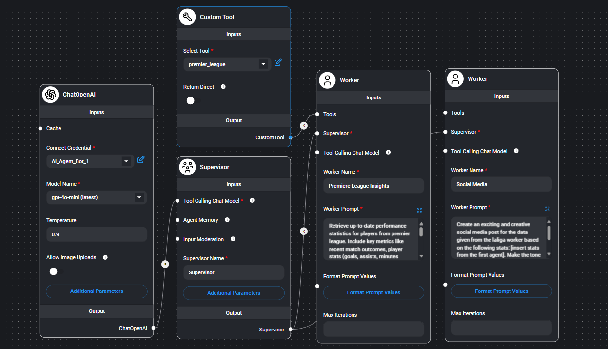

# Premier League Players Insights AI Agent

## Project Objective
The "Premier League Players Insights" AI agent can answer any question related to players in the English Premier League, such as who the top scorers or top assisters are. The AI agent retrieves real-time data using the Premier League API and generates creative and informative social media posts based on the information. This project is useful for sports analysts, football fans, and social media managers who need quick access to player statistics.

## Project Architecture

The project architecture consists of one supervisor agent and two worker agents:

1. **Supervisor Agent:**
   - **Model**: GPT-4 mini (ChatGPT 4o mini)
   - **Temperature**: 0.9 (allows for more creative responses in the final output)
   - **Role**: The supervisor oversees the overall workflow and ensures that the correct data is fetched and used to generate social media posts. It also processes the final answers from the workers.

2. **Worker Agents:**
   - **Worker 1: Premier League Insights**:
     - **Custom Tool**: `premier_league` (fetches data from the English Premier League API)
     - **API Call**: Retrieves data on either the top scorers or top assisters in the Premier League.
     - **Type Variable**: Accepts a value that determines whether the agent is fetching data on "top scorers" or "top assisters."
     - **JavaScript Function**:
       ```javascript
       const fetch = require('node-fetch');

       const url = 'https://premier-league18.p.rapidapi.com/players/' + $type;
       const options = {
         method: 'GET',
         headers: {
           'x-rapidapi-key': '833ea7ba82msh4fa3fedede5370bp1dc78fjsnda3c55a049ba',
           'x-rapidapi-host': 'premier-league18.p.rapidapi.com'
         }
       };

       try {
         const response = await fetch(url, options);
         const result = await response.text();
         return result;
       } catch (error) {
         return error;
       }
       ```
   - **Worker 2: Social Media Worker**:
     - **Role**: This agent takes the information retrieved by the Premier League Insights worker and creates a catchy social media post based on that data. The post is designed to engage followers with highlights of the players' achievements (such as the current top scorer or assister).

## Agent Flow
The following diagram represents the agent flow in Flowise:



1. **User Query**: A user asks a question like "Who are the top scorers in the Premier League?"
2. **Supervisor Agent**: The supervisor processes the query and routes it to the `Premier League Insights` worker.
3. **Premier League Insights Worker**: The worker fetches data from the Premier League API based on the query (either top scorers or top assisters).
4. **Social Media Worker**: The retrieved data is passed to the Social Media Worker, which generates a social media post.
5. **Final Answer**: The supervisor agent finalizes the post and returns it to the user.

## Key Features
- **Real-time Data**: The AI agent fetches live data from the Premier League API to ensure accurate and up-to-date responses.
- **Custom API Integration**: Utilizes a custom JavaScript tool to interact with the Premier League API.
- **Social Media Generation**: Automatically creates engaging social media content based on player stats.

## Example Outputs
Here are some example questions and the corresponding outputs provided by the AI agent:

- **Question 1**: "Who are the top scorers in the Premier League?"
  - **Answer**:
    ```
    🏆 Top Scorers in the Premier League (As of now):
    
    Erling Haaland (Manchester City)
    
    Goals: 10
    Assists: 0
    Matches Played: 7
    Minutes Played: 682
    Cole Palmer (Chelsea)
    
    Goals: 6
    Assists: 5
    Matches Played: 7
    Minutes Played: 649
    Bryan Mbeumo (Brentford)
    
    Goals: 6
    Assists: 0
    Matches Played: 7
    Minutes Played: 670
    Luis Diaz (Liverpool)
    
    Goals: 5
    Assists: 1
    Matches Played: 7
    Minutes Played: 468
    Ollie Watkins (Aston Villa)
    
    Goals: 4
    Assists: 2
    Matches Played: 7
    Minutes Played: 546
    Stay tuned for more updates! 🔥 #EPL #PremierLeague #FootballStats
    ```
  - **Social media post**:
    ```
    🚀⚽️ Premier League Showdown: Who's Lighting Up the Scoring Charts? 🔥
    
    As we dive into an electrifying season, here's who's leading the way in goal-scoring excellence! 🏃‍♂️💨
    
    1️⃣ Erling Haaland (Manchester City) - The goal machine with 10 goals in just 7 matches is proving unstoppable! 💪⚡️
    2️⃣ Cole Palmer (Chelsea) - Not just a scorer, he's assisting too with 6 goals and 5 assists!
    3️⃣ Bryan Mbeumo (Brentford) - Matching Palmer with 6 goals and keeping the pressure on!
    4️⃣ Luis Diaz (Liverpool) - The Colombian sensation with 5 goals continues to dazzle! 🇨🇴✨
    5️⃣ Ollie Watkins (Aston Villa) - Rounding out the top 5 with 4 goals and 2 assists!
    
    Who's your favorite? And who do you think will rise to the top by season's end? Let us know! 👇💬
    
    #EPL #PremierLeague #GoalScorers #FootballFever #HaalandMagic #ColePalmer #Mbeumo #LuisDiaz #OllieWatkins
    ```
- **Question 2**: "Who are the top assisters?"
  - **Answer**:
    ```
    Here are the current top assisters in the Premier League:
    
    Bukayo Saka (Arsenal)
    
    Goals: 2 | Assists: 8 | Appearances: 7 | Minutes Played: 603
    Cole Palmer (Chelsea)
    
    Goals: 6 | Assists: 5 | Appearances: 7 | Minutes Played: 649
    Wilfred Ndidi (Leicester)
    
    Goals: 0 | Assists: 4 | Appearances: 7 | Minutes Played: 635
    Mohamed Salah (Liverpool)
    
    Goals: 4 | Assists: 4 | Appearances: 7 | Minutes Played: 642
    Jadon Sancho (Chelsea)
    
    Goals: 0 | Assists: 3 | Appearances: 4 | Minutes Played: 268
    Nicolas Jackson (Chelsea)
    
    Goals: 4 | Assists: 3 | Appearances: 7 | Minutes Played: 537
    Bernardo Silva (Manchester City)
    
    Goals: 0 | Assists: 3 | Appearances: 7 | Minutes Played: 607
    Jarrod Bowen (West Ham)
    
    Goals: 2 | Assists: 3 | Appearances: 7 | Minutes Played: 627
    Adam Lallana (Southampton)
    
    Goals: 0 | Assists: 2 | Appearances: 4 | Minutes Played: 137
    Savio (Manchester City)
    
    Goals: 0 | Assists: 2 | Appearances: 5 | Minutes Played: 305
    Stay tuned for more updates and let’s cheer for our favorite players! ⚽️ #PremierLeague #TopAssisters
    ```
  - **Social media post**:
    ```
    🚀⚽️ Let’s give a standing ovation to the Premier League's assist maestros! 🎉 Here are the top playmakers lighting up the pitch this season:
    
    1️⃣ Bukayo Saka (Arsenal): Leading the charge with a whopping 8 assists! Not to mention his electric runs that keep defenders on their toes! 🔥
    
    2️⃣ Cole Palmer (Chelsea): With 5 assists and 6 goals, he’s proving to be a dual threat – watch out for this rising star! 🌟
    
    3️⃣ Wilfred Ndidi (Leicester): Quietly serving up 4 assists while holding the midfield together like a true warrior! 💪
    
    4️⃣ Mohamed Salah (Liverpool): Our favorite Egyptian King isn't just scoring with 4 goals, but also dishing out 4 assists! 👑⚽️
    
    5️⃣ Jadon Sancho (Chelsea): Although he’s got no goals yet, his 3 assists show he’s contributing significantly to the team's attack!
    
    Who’s been your favorite assist king so far? Let’s hear your thoughts! 🗣️🙌
    
    #PremierLeague #AssistKings #FootballMagic #SakaMagic #EmergingStars #GoalAssist #FootyFans #LoveTheGame
    ```

## How to Run This Project
This project was created using Flowise, a no-code platform for building LangChain-based AI agents. Follow these steps to replicate the setup:

### Prerequisites
1. A Flowise account (or set up Flowise locally).
2. OpenAI API key for chat model integration.
3. RapidAPI account with access to the Premier League API.

### Setup Steps
1. Clone this repository:
   ```bash
   git clone https://github.com/yourusername/Premier-League-Players-Insights-Agent.git
   cd Premier-League-Players-Insights-Agent
